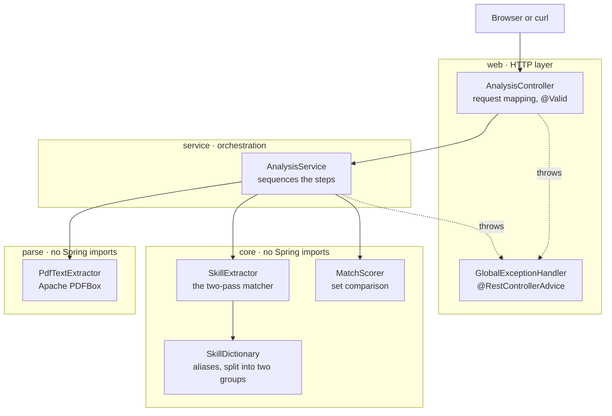

# Skill Gap Analyzer

A REST API that compares a candidate's skills against a job description and reports the
gap: what matches, what is missing, and what the candidate has that the job never asked
for.

Built with Java 21 and Spring Boot 3.5. The matching engine is written in plain Java with
no framework dependencies, so it can be unit tested without starting a Spring application
context.

---

## Contents

- [What it does](#what-it-does)
- [Tech stack](#tech-stack)
- [Getting started](#getting-started)
- [API reference](#api-reference)
- [How the matching works](#how-the-matching-works)
- [Architecture](#architecture)
- [Design decisions](#design-decisions)
- [Testing](#testing)
- [Known limitations](#known-limitations)
- [Possible next steps](#possible-next-steps)

---

## What it does

You give it two things:

1. Your skills, either typed as a list or uploaded as a PDF resume.
2. The raw text of a job description, pasted in exactly as it appears on the job board.

It returns a match score and three lists:

| Field | Meaning |
| --- | --- |
| `matchScore` | Percentage of the job's required skills that you have. |
| `matchedSkills` | Skills the job asked for that you have. |
| `missingSkills` | Skills the job asked for that you do not have. **This is the gap.** |
| `extraSkills` | Skills you have that the job never asked for. |

Example, using a real trainee developer advert:

```
Before working through this project:  27.3%
  missing: Docker, Java, Kafka, Kubernetes, Maven, MySQL, Spring Boot, Spring Data JPA

After:                                72.7%
  missing: Docker, Kafka, Kubernetes
```

A browser interface is included at `http://localhost:8081/` for trying it by hand. It is a
single static HTML file containing no scoring logic of its own; every number it displays
comes from the Java service.

---

## Tech stack

| Component | Choice | Why |
| --- | --- | --- |
| Language | Java 21 | Current long-term-support release. |
| Framework | Spring Boot 3.5.16 | Spring Web for REST, Bean Validation for input checking. |
| Build | Maven, via the included wrapper | `mvnw` means no global Maven install is needed. |
| PDF parsing | Apache PDFBox 3.0.8 | Reads the text layer out of an uploaded PDF resume. |
| Testing | JUnit 5, AssertJ, MockMvc | 85 tests; 62 need no Spring context. |
| Persistence | None | See [Design decisions](#design-decisions). |

---

## Getting started

Requires **Java 21 or newer**. Maven is not required, because the project ships the Maven
wrapper.

```bash
git clone https://github.com/Aashfa/Resume-Screening.git
cd Resume-Screening
./mvnw spring-boot:run
```

On Windows use `.\mvnw.cmd spring-boot:run`.

Then open <http://localhost:8081/>.

The first run downloads Maven and the project dependencies, so it takes a couple of
minutes. Subsequent runs start in about twenty seconds.

To run the tests:

```bash
./mvnw test
```

### Changing the port

The application listens on **8081** rather than the usual 8080, because port 8080 was
already occupied on the machine it was developed on. Change it in
`src/main/resources/application.properties`:

```properties
server.port=8080
```

---

## API reference

### `POST /api/analyze`

Analyses a typed list of skills. Stateless: nothing needs to be created or saved first.

```bash
curl -X POST http://localhost:8081/api/analyze \
  -H "Content-Type: application/json" \
  -d '{
        "candidateSkills": ["C++", "C#", "SQL", "Git"],
        "jobDescriptionText": "We need a Java developer with Spring Boot, REST APIs and Docker experience."
      }'
```

```json
{
  "matchScore": 0.0,
  "matchedSkills": [],
  "missingSkills": ["Docker", "Java", "REST API", "Spring Boot"],
  "extraSkills": ["C#", "C++", "Git", "SQL"],
  "extraSkillCount": 4,
  "requiredSkillCount": 4,
  "candidateSkillCount": 4
}
```

Nothing matched here, because the advert asks for Java, Spring Boot, REST APIs and Docker,
and this candidate has none of them. Their C++, C#, SQL and Git are all real skills, but
none of them is what this particular job asked for, so they are reported as extras and
leave the score at zero.

### `POST /api/analyze/resume`

Same analysis, but the candidate's skills are read from an uploaded PDF resume.
Sent as `multipart/form-data`, because JSON has no binary type.

```bash
curl -X POST http://localhost:8081/api/analyze/resume \
  -F "file=@my-resume.pdf;type=application/pdf" \
  -F "jobDescriptionText=We need a Java developer with Spring Boot and Docker experience."
```

### `GET /api/skills`

Every skill the dictionary can recognise, with a count. Useful for understanding why
something was or was not detected.

### `GET /api/health`

Returns `{"status":"UP"}`.

### Error responses

Every failure returns the same shape, produced by a single
`@RestControllerAdvice` class, so a client only ever has to parse one structure.

| Status | Meaning |
| --- | --- |
| `400 Bad Request` | Input failed validation, or the JSON was malformed. Includes a per-field breakdown. |
| `413 Payload Too Large` | The uploaded PDF exceeded the 5 MB limit. |
| `415 Unsupported Media Type` | The upload was not a PDF. |
| `422 Unprocessable Entity` | The request was understood but could not be used: no recognisable skills in the job description, or a PDF with no readable text. |

A validation failure reports every problem at once, rather than making the caller fix them
one at a time:

```json
{
  "timestamp": "2026-08-18T07:26:58.546Z",
  "status": 400,
  "error": "Bad Request",
  "message": "Request validation failed",
  "path": "/api/analyze",
  "fieldErrors": {
    "candidateSkills": "candidateSkills must contain at least one skill",
    "jobDescriptionText": "jobDescriptionText must be between 10 and 50000 characters"
  }
}
```

---

## How the matching works

The hard part of this project is not the scoring. It is turning a messy paragraph of
English into a clean set of skill names. Once both sides are clean sets, comparing them is
three lines of set arithmetic.

Everything is driven by `src/main/resources/skills.json`, which maps each canonical skill
name to the aliases people actually write:

```json
{
  "Spring Boot": ["spring boot", "springboot", "spring-boot"],
  "C++":         ["c++", "cpp", "c plus plus"],
  "MySQL":       ["mysql", "my sql"]
}
```

At startup the dictionary sorts every alias into one of two groups, because they need two
completely different matching strategies.

### Pass 1: skills containing punctuation

Some technology names contain characters that word-splitting destroys:

```
"C++"       normalised becomes  "c"       which collides with the letter C
"C#"        normalised becomes  "c"       same collision
".NET Core" normalised becomes  "net core"
```

If the text were normalised first, the tool would not merely fail to find C++. It would
report the **wrong skill**. So punctuation-bearing aliases are found first, by literal
substring search over the raw lowercased text, and two rules apply:

- **Longest alias first.** `.net core` is tried before `.net`, so the more specific skill
  wins.
- **Each match is blanked out** of the working text. Without this, the leftover `c` from
  `c++` gets read again in pass 2 and reported as a separate skill.

There is also a boundary check, so `.net` is not matched inside `asp.net`.

### Pass 2: everything else

What survives pass 1 is normalised (every non-alphanumeric character becomes a space) and
split into words. Then a window of one, two, or three consecutive words slides across the
text, and each window is looked up in the dictionary.

**Why the window stops at three words.** The scan costs
`O(number of words × window size)`, so it is linear in the length of the job description.
Raising the limit to six would double the work, and the question is what it would catch in
return. Real skill names at the three-word limit include `spring data jpa`,
`amazon web services`, and `object oriented programming`. Beyond three words you are
matching marketing prose, not skills. Three is where the curve of useful matches flattens
out, which is where the extra scanning stops paying for itself.

**Longest match wins here too.** At each position the three-word window is tried first,
then two, then one; the first hit is taken and the scanner skips past it. This matters:
the dictionary maps `spring` to Spring Framework and `spring boot` to Spring Boot, so
recording every window that matched would report both for the text "Spring Boot".

### Both sides use the same dictionary

The candidate's skills are canonicalised through the same dictionary as the job
description. Without this, a candidate who writes `springboot` would be compared against a
job advert saying `Spring Boot`, no match would be found, and the tool would confidently
tell them to go and learn something they already know.

### Scoring

```
matched = candidate ∩ required
missing = required  − candidate     ← the gap
extra   = candidate − required

matchScore = matched.size / required.size × 100
```

---

## Architecture



Package layout:

```
dev.lateef.skillgap
├── config     SkillGapConfiguration   @Bean definitions for the core classes
├── core       the matching engine     no Spring imports at all
├── parse      PDF text extraction     no Spring imports at all
├── dto        AnalyzeRequest/Response the HTTP contract
├── service    AnalysisService         orchestration only
└── web        controller + error handling
```

Requests flow `web → service → core`. Nothing in `core` or `parse` knows that Spring
exists, so the dependency arrow only ever points inward.

---

## Design decisions

**The matching engine has no framework dependencies.** `SkillExtractor`, `MatchScorer`,
and `PdfTextExtractor` carry no `@Component` or `@Service` annotation and import nothing
from Spring. They are registered as beans by `@Bean` methods in
`config/SkillGapConfiguration`, which keeps the classes themselves unaware of the
container. The payoff is measurable: 62 of the 85 tests construct these objects with `new`
and finish in about two seconds in total, while the 23 that boot Spring take roughly 25
seconds between them.

**Extra skills are reported but excluded from the score.** `matchScore` answers one
question: how much of what this job asked for does the candidate have? Extra skills are by
definition things the job did not ask for, so they cannot change that number without
changing what it means. Concretely, if extras added a point each, a candidate with 3 of 5
required skills plus 45 unrelated ones would score 105 and outrank a perfect match. Worse,
this is a resume screener, and padding a CV with keywords is the most common way real
screeners are gamed; rewarding extra skills would build that exploit into the metric.
Extras are therefore counted in `extraSkillCount` and listed in full, but kept out of the
score.

**No database.** Every request carries everything needed to answer it, and nothing is
persisted. This is a genuine constraint of the current design rather than an oversight:
adding persistence would mean adding `spring-boot-starter-data-jpa`, a driver, and a
datasource URL, but would require no change to the extraction or scoring classes, because
they have no framework dependencies to disturb.

**An empty requirement list scores 0, not 100.** Strictly, a candidate vacuously satisfies
a job that requires nothing. But reporting "100% match" for a job description we failed to
parse would read as a perfect candidate, when what actually happened is that we could not
score at all. The empty `missingSkills` list is what distinguishes the two cases.

**Uploaded files are validated by their magic bytes**, not by filename or the
browser-supplied `Content-Type`. Both of those are controlled by the caller and are
routinely wrong even without anyone acting maliciously.

**A dictionary alias longer than three words is rejected at startup.** Such an alias could
never be matched by a three-word window, so it would fail silently forever. Refusing to
start is preferable to serving quietly wrong answers.

### A bug found during development, and why it mattered

An earlier version of pass 2 recorded *every* window that matched, including shorter
windows nested inside longer ones. Because the dictionary maps `spring` to Spring Framework
and `spring boot` to Spring Boot, this happened:

| Candidate wrote | Canonicalised to | Score | Told to learn |
| --- | --- | --- | --- |
| `Spring Boot` | Spring Boot, Spring Framework | 100% | — |
| `springboot` | Spring Boot | **50%** | **Spring Framework** |

Two spellings of one skill produced two different answers, and the tool told a candidate
who knew Spring Boot to go and learn Spring Framework. For a gap analyser, a false gap is
the worst possible failure.

The fix was to make pass 2 greedy, exactly as pass 1 already was: take the longest match
at each position and skip past it. The regression tests for this live in
`SkillExtractorOverlapTest`.

The reason the original unit tests missed it is worth recording. They used small
hand-written dictionaries that did not contain the overlapping aliases; only the real
`skills.json` did. **A test fixture cleaner than your production data will hide every bug
that only production data can trigger.**

---

## Testing

```bash
./mvnw test
```

85 tests, split deliberately:

| Suite | Tests | Boots Spring | What it covers |
| --- | --- | --- | --- |
| `SkillExtractorTest` | 19 | no | n-gram windows, punctuation, case, deduplication |
| `SkillExtractorOverlapTest` | 9 | no | nested-alias regressions, against the real dictionary |
| `MatchScorerTest` | 18 | no | set arithmetic, scoring, edge cases, immutability |
| `SkillDictionaryTest` | 8 | no | alias routing, ordering, validation |
| `PdfTextExtractorTest` | 8 | no | real generated PDFs, corrupt and scanned files |
| `AnalysisControllerTest` | 13 | yes | status codes, JSON shape, validation, error handling |
| `ResumeUploadControllerTest` | 9 | yes | multipart upload paths |
| `SkillGapAnalyzerApplicationTests` | 1 | yes | the context loads |

The PDF tests build genuine PDF files in memory with PDFBox rather than mocking it.
Mocking the library would only prove the code calls the methods it was told to call; it
would not prove a real PDF can be read, which is the entire job of that class.

---

## Known limitations

**No skill hierarchy.** `MySQL` and `SQL` are unrelated dictionary entries, so a candidate
who knows SQL applying for a MySQL role sees `MySQL` in the gap and `SQL` in the extras. A
human reviewer would award partial credit. Implementing this properly means declaring that
MySQL implies SQL, and Spring Boot implies Spring Framework.

**Dictionary-bound.** Only skills present in `skills.json` can be detected. A job
description asking for something unlisted is invisible to the tool. This is a deliberate
trade: a curated dictionary is predictable and explainable, where a machine-learning
approach would be neither, and would need training data this project does not have.

**Scanned resumes are rejected.** Text is read from a PDF's text layer. A resume that was
scanned or exported as an image has no text layer, and recovering text from pixels needs
optical character recognition, which is out of scope. Such files return `422` with an
explanation rather than a misleading "0 skills found".

**Uploaded resumes yield only known skills.** When skills are typed in, unrecognised
entries are preserved and reported as extras. Prose cannot be treated that way: in a wall
of resume text there is no way to tell an unlisted skill from an ordinary noun. So the
extras list is shorter for an uploaded resume than for the same person typing their skills
by hand.

**No authentication or rate limiting.** This is a demonstration service, not a deployed
product.

---

## Possible next steps

- A skill hierarchy so related skills earn partial credit.
- Weighting, so a skill mentioned in a "requirements" section counts for more than one
  mentioned in passing.
- Optical character recognition for scanned resumes.
- Persistence, to track how a candidate's match score improves over time.
- Support for `.docx` uploads alongside PDF.
